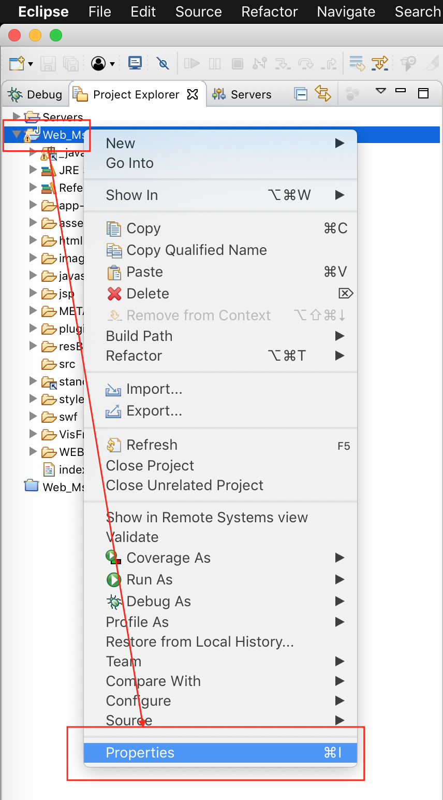
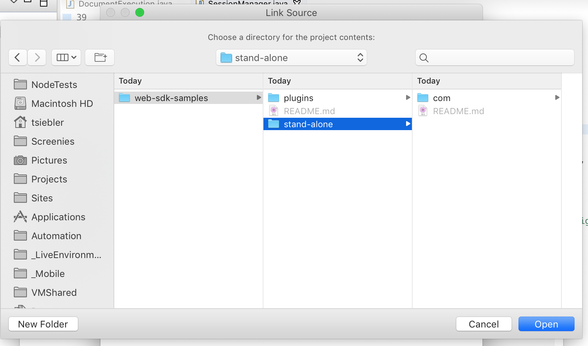
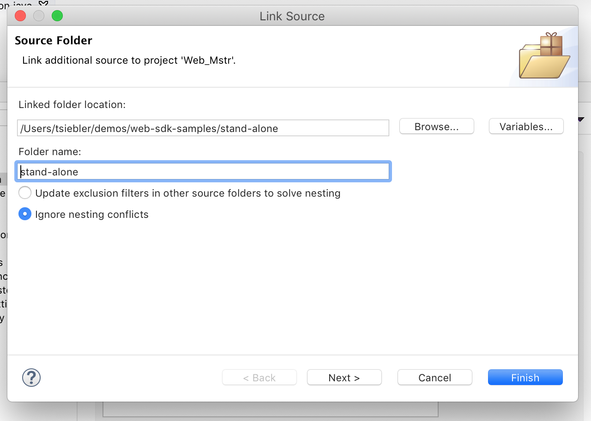
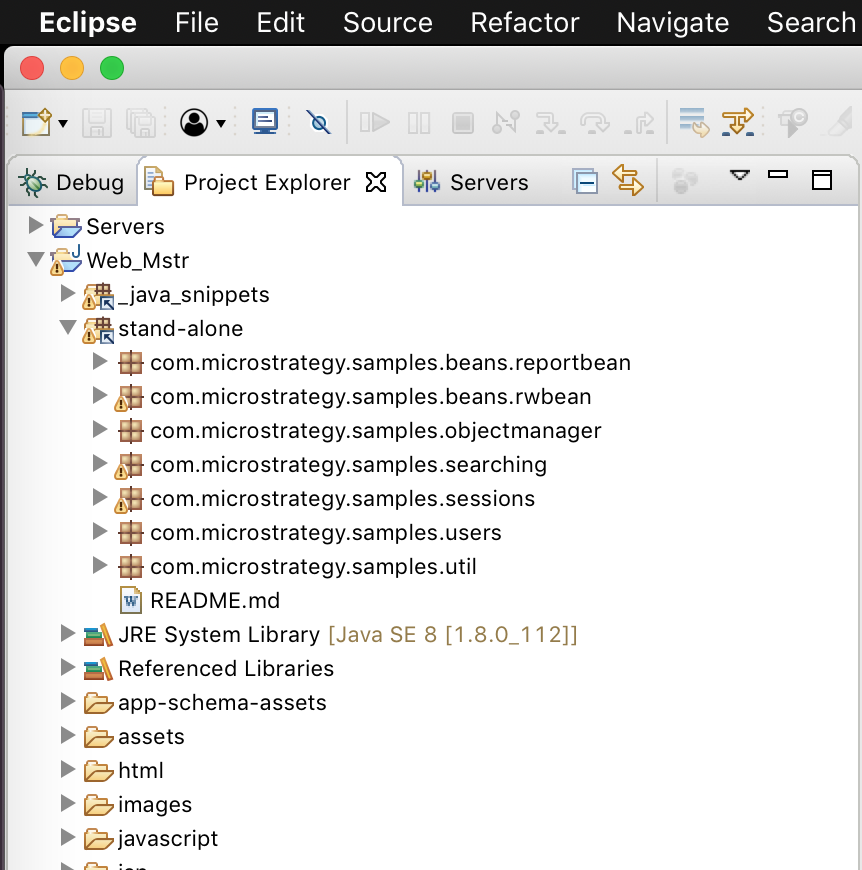
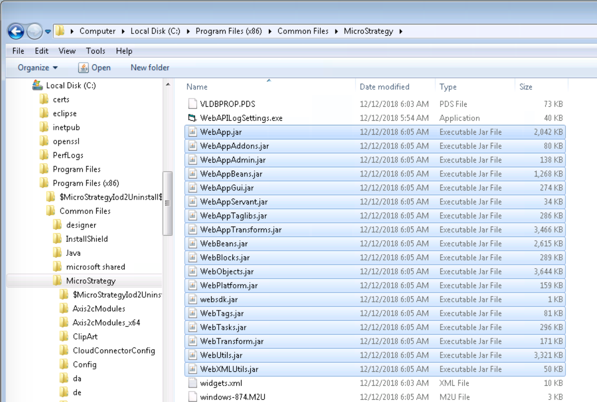

# Using these samples as a source in Eclipse

The Java samples found in this directory can be used directly within Eclipse, by adding the `stand-alone` folder as a source folder. This guide demonstrates the workflow.

## Clone the repo

If not already done, clone this repo using your favourite git client:
```
git clone https://github.com/MicroStrategy/web-sdk-samples.git
```

## Adding the source folder to Eclipse
- Open Eclipse and select a workspace.
- Navigate to the **Project Explorer** in Eclipse.
  - Note: in some perspectives, such as the _Web Customization Editor_ this may be named **Package Explorer**.
- Right-click on your project and select **Properties**:


- Navigate into the **Java Build Path** category and select the **Source** tab.
- Choose **Link Source...** and then **Browse** to select the path to your source folder.
- Navigate to **web-sdk-samples** cloned from this repo and select the **stand-alone** folder.


- The **Linked folder location:** field should point to the **stand-alone** folder from the cloned repo.
  - E.g `/Users/tsiebler/demos/web-sdk-samples/stand-alone`
  

- Click **Finish** to close the **Link Source** dialog.
- Click **Apply and Close** to close the project properties dialog.

The **stand-alone** folder and all packages within should now be visible from the **Project Explorer**:


The java classes within these packages can be opened and executed directly in Eclipse, if all Jar dependencies are also present.

## Adding missing jar libraries
Depending on how the Eclipse workspace was previously configured, some of the Web SDK libraries may be missing, preventing one or more samples from compiling successfully.

The MicroStrategy Web SDK libraries are included with MicroStrategy Web.

### Web Customization Editor Perspective
If using the Web Customization Editor, these libraries are usually added automatically to the workspace build path. If not, or some are missing, refer to the "Other Perspectives" guidance below.

### Other Perspectives
Other perspectives may require manual configuration to point the java build path to the java libraries included with MicroStrategy Web.

#### Adding missing libraries to the Eclipse Workspace
- Open Eclipse and select a workspace.
- Navigate to the **Project Explorer** in Eclipse.
  - Note: in some perspectives, such as the _Web Customization Editor_ this may be named **Package Explorer**.
- Right-click on your project and select **Properties**.
- Navigate into the **Java Build Path** category and select the **Libraries** tab.
- Select **Add External JARs...** and navigate to where your MicroStrategy Web .jar libraries are found.
- Navigate to and select to add the missing libraries.
- Finish by clicking **Apply and Close** to close the project properties dialog.

#### MicroStrategy Web SDK Libraries Location
##### J2EE
In J2EE environments, such as MicroStrategy Web deployed in Tomcat, these .jar libraries can be found under the following path within your Tomcat installation:
```
path/to/tomcat/webapps/MicroStrategy/WEB-INF/lib/
```


##### ASP - IIS
In ASP envionrments, these .jar libraries can be found in the MicroStrategy installation directory. By default, these libraries can be found under the following path within your MicroStrategy installation:
```
C:\Program Files (x86)\Common Files\MicroStrategy\
```


